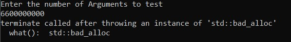
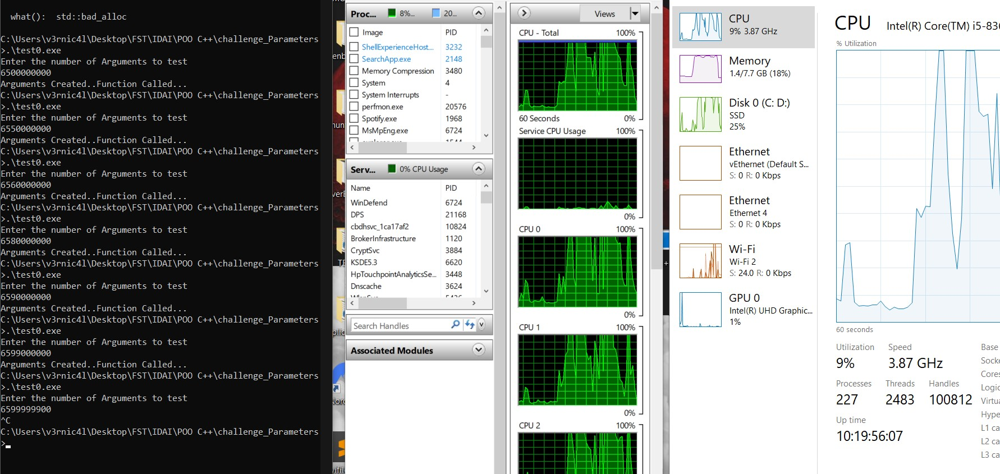

# Parameters-Challenge

## Abstraction
The objective of this analysis is to test and stress the number of arguments passed into a regular C++ function until the program raises an error or becomes unstable. Theoretically, the C++ standard suggests that it should support at least 256 parameters/arguments. The first few arguments are often placed in CPU registers, providing easier access and better performance compared to memory, while the remaining arguments are copied onto the stack. Depending on the machine architecture and performance, it is safe to say that these test results can vary widely across different machines. The only constraint is the reliance on memory allocation and the calculations a program must endure to create a structure and allocate memory for large-sized arguments.

## Results Obtained
- **General Analysis**: Due to the high consumption of time and energy that a machine undergoes during each new memory allocation, it would be **dangerous** and **potentially fatal** for a machine to handle a loop constructing billions of iterations.
- For research purposes, we can continue testing manually to ensure safety.
  
- **Summary of Findings**: We worked with a script capable of allocating memory for arguments up to a certain extent, relying on the performance of each machine and its own limits.
- So for exemple a machine running in Win 10 64-bits with a CPU **Intel i5-8365 @1.6GHZ** and a memory of **8GB** and a disk storage **SSD 256BG**
- We initiated the test with 1 billion arguments, gradually increasing up to 4 billion. However, when we started testing with 5 billion arguments, we noticed some latency and slowdowns, with an average delay of 3 to 4 seconds. As we continued testing with 5.1e9, 5.2e9, 5.3e9, up to 6.5e9 arguments, the machine became progressively slower. By the time we reached 6.5 billion arguments, the system became highly unstable, leading to the crash of all running programs and the failure of essential drivers.
- On the other hand testing with 6.6e9 arguments raised an error of "bad_alloc"
- 
- 

- **Reached Limit** 
